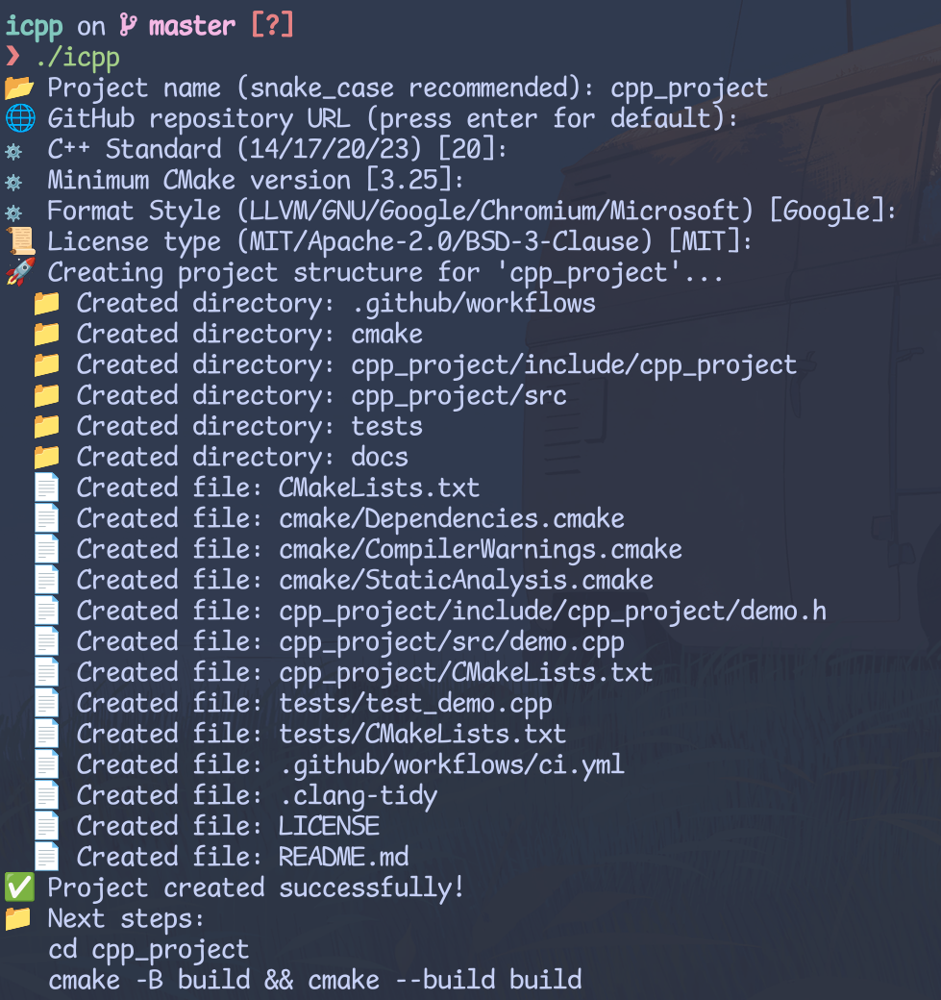

# ICPP

## Overview

icpp is a modern C++ project built with CMake. It provides a robust foundation for developing high-performance applications, incorporating best practices and tools to ensure code quality and maintainability.

## Features

- **Modern CMake Configuration**: Utilizes the latest CMake practices for efficient build management.
- **Integrated Testing**: Includes a testing framework using [GoogleTest](https://github.com/google/googletest) for unit tests.
- **Static Analysis**: Employs tools like `clang-tidy` and `cppcheck` for code analysis and linting.
- **Continuous Integration**: Pre-configured GitHub Actions workflow for automated building and testing.
- **Code Formatting**: Enforces consistent code style with `clang-format`.

## Getting Started

### Prerequisites

Ensure the following dependencies are installed:

- CMake (version 3.25 or higher)
- C++ Compiler with C++17 support or above
- `clang-format`
- `clang-tidy`
* `cppcheck`
- Git

### Create Cpp Project by icpp

Simply run this command,

```shell
icpp
```

The project will automatically setup.

